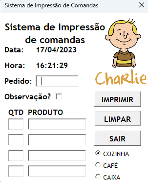
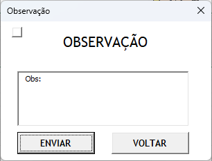

<h1 align="center">Projeto elaborado em VBA</h1>

## Nesse repositório você encontra um sistema de impressão de comandas para o Ifood.

 <h2 align:="right">:scroll: Uma breve descrição:</h2>

### Este projeto foi desenvolvido em 2022 para sanar um problema no atendimento ao delivery. Ao receber os pedidos do Ifood, o atendente redigia a mão os pedidos e encaminhava até a cozinha. Com esse programa, esse processo ficou automatizado, o atendente consegue inserir o produto, a impressora desejada e a comanda é impressa no local correto, agilizando o processo, diminuindo as possibilidades de erro e melhorando a qualidade de vida dos usuários, visto que antes da implantação desse programa, havia muita tensão entre atendimento e cozinha.
 

<h1>Aparência do programa</h1>

 
- A data e a hora são atualizadas automaticamente a cada vez que o usuário movimenta o mouse sobre a tela;

- O campo pedido deve ser inserido com o número do pedido do Ifood;
- Os campos quantidade e produto devem ser inseridos pelo menos uma vez;
- O local de impressão pode ser selecionado através do seletor localizado no canto direito inferior da tela;
- O usuário pode inserir uma observação no pedido marcando a caixa de observação, a qual abrirá uma nova tela:

- O usuário pode limpar todos os campos clicando no botão *Limpar*;
  

----------

Além desse projeto, aos poucos colocarei nos meus repositórios os outros projetos também, são eles:

1. Sistema de controle de produção  
2. Sistema de controle de produção simplificado
3. Controle de estoque e produção de datas comemorativas
4. Projeto desenvolvido para IT Academy 18
----------
Sempre quero me desenvolver, portanto estou aberto a sugestões, críticas, elogios, etc. Muito obrigado!
